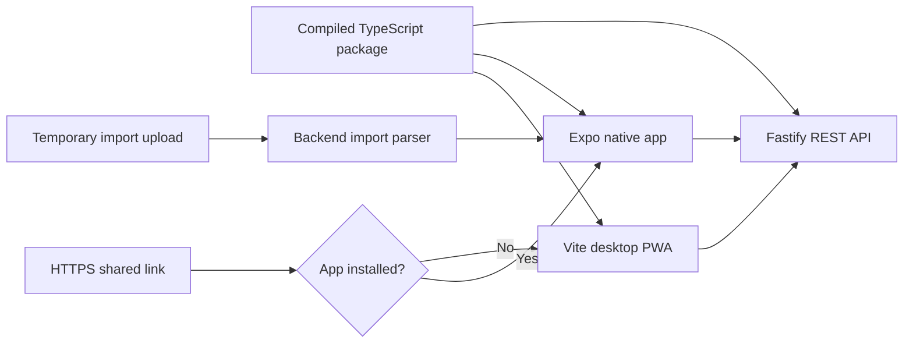
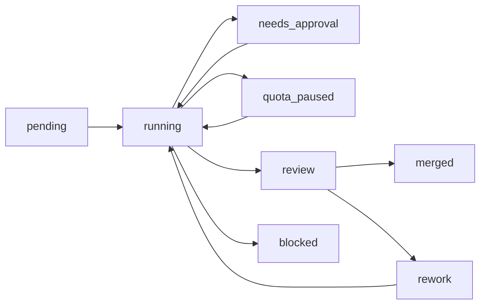

# Parallel Mobile Migration Implementation Plan

> **For agentic workers:** Use isolated worktrees and one owning agent per task. Follow the dependency gates and file-ownership rules below.

**Goal:** Build a near-feature-parity Expo/React Native app for iOS and Android while retaining the Vite PWA for desktop.

**Why native:** The product owner wants a true native mobile look and feel — no browser chrome, native navigation/gesture physics, real app-switcher/App Store presence — and optimized mobile UX, rather than a PWA in a browser. Task 0's spike must confirm this gap is real and native-only. **Confirmed 2026-09-07:** Task 0 spike (Expo Go on a physical Android device against the live backend: native shell, login, library FlatList, pull-to-refresh) was judged by the product owner to feel "way better" than the PWA. Gate passed; Waves 1–5 proceed.

This plan currently states a solution with no problem. A mobile-web program already shipped in this repo and covers most of what a native app would close: bottom tab bar and More drawer ([`frontend/src/layouts/DashboardLayout.tsx`](../../../frontend/src/layouts/DashboardLayout.tsx)), offline banner, workbox runtime caching for `/library` and covers ([`frontend/vite.config.ts`](../../../frontend/vite.config.ts)), `@dnd-kit` touch reorder, touch mural editing ([`frontend/src/components/murals/MobileMuralCanvas.tsx`](../../../frontend/src/components/murals/MobileMuralCanvas.tsx)), edge-swipe back, and HTTPS dev certs for on-device Add-to-Home-Screen testing. Name the capability the PWA provably lacks — App Store presence, push notifications, background sync, offline writes — and record it on the line above. Wave 3's gate re-implements 21 routes in React Native; that cost needs a named payoff.

**Architecture:** Add `mobile/` as a third client of the existing Fastify REST API. Share only framework-neutral TypeScript, process imports temporarily on the backend, and use universal links with web fallback.

**Tech stack:** Expo, React Native, Expo Router, TanStack Query, Fastify, TypeScript, npm workspaces, SecureStore, AsyncStorage, Gesture Handler, Reanimated, Maestro, EAS.

## Global constraints

- Read [`AGENTS.md`](../../../AGENTS.md) and each package README before working.
- Preserve the existing Fastify modular backend and Vite desktop PWA. Every wave gate re-checks the PWA, not just the new client.
- Never place access or refresh tokens in URLs. This already fails today: `backend/src/modules/auth/plugin.ts` redirects Google sign-in with `access_token`/`refresh_token` in the URL fragment, and `frontend/src/pages/OAuthSuccessPage.tsx` reads them from `location.hash`. Task 4A owns fixing both.
- Never persist uploaded import source files.
- Keep integration-owner files single-writer.
- Each branch must pass its package typecheck and tests before handoff, using the exact commands below.
- Produce working preview builds throughout; near parity is the store-release gate.

**Exact check commands.** `backend` has no `lint` script; do not invent one.

```
cd backend  && npm install && npm run typecheck && npm test
cd frontend && npm install && npm run typecheck && npm run lint && npm test
```

`npm install` and both lines above are pre-authorized for every task.

**Deployment prerequisite.** Nothing in this repo is deployed: no Dockerfile, no CI, no host config, and every OAuth callback URL points at `localhost` (the frontend README documents this dead end for LAN testing). Waves 2–5 require a deployed HTTPS origin serving `backend` and `frontend`, plus final iOS/Android bundle IDs, the Apple Team ID, and the Android signing SHA-256. Universal links and mobile Google OAuth cannot be built or tested without them — see Task 4C.

## Decisions and target architecture

- Add `mobile/` beside `frontend/` and `backend/`.
- Use the existing REST/JWT API directly; do not add a BFF.
- Add a small `@scripta/shared` package for proven cross-client logic only. It ships compiled output (`tsc` build, `exports` pointing at `dist`) because `backend` builds with `tsc` and cannot consume raw TS from a workspace sibling; `frontend` and `mobile` are bundler-based and would work either way.
- `backend` is the third consumer of `@scripta/shared`, not just the two clients — Task 4B needs the same CSV parsers the PWA uses, and a source-only package guarantees a second copy that drifts.
- Parse Kobo SQLite and Goodreads/StoryGraph CSV imports on the backend, return preview data, then discard uploads. The exporter's own `library.json` is already `LibraryData` and is parsed on-device with `JSON.parse` — it needs no server round-trip.
- Use iOS Universal Links and Android App Links with existing web routes as fallback, **once the HTTPS origin exists**. Until then use a custom-scheme deep link for development builds; App Links and AASA verification cannot be exercised without a registered domain, so building them early buys nothing.
- Start with React Native `FlatList`; add another list library only if later profiling shows a real need.



## Agent execution rules

- Give every task an isolated worktree and branch.
- The integration owner exclusively edits:
  - Root workspace files and lockfiles.
  - `mobile/app/_layout.tsx`.
  - `backend/src/app.ts`.
  - `backend/src/config/env.ts`.
- Feature agents own their `mobile/src/features/<feature>/` directory and corresponding file-based routes.
- Feature agents must not edit central navigation or package manifests.
- Use fixture-backed interfaces so parallel UI work does not wait for every backend branch.
- Merge only at wave gates, then run the full workspace suite.

## Three-agent orchestration

### Persistent ownership

- **OpenCode with Z.ai — automated coordinator and integration owner**
  - Owns the migration branch, task state, worktrees, root workspace files, lockfiles, central Expo navigation, CI, backend registration/environment integration, and merges.
  - Invokes Claude Code through `claude -p` and Codex through `codex exec`; it does not share credentials or call their model APIs.
  - May implement assigned feature work only from a separate worktree; never develop directly on the integration worktree.
- **Claude Code — backend and library owner**
  - Owns native authentication, backend OAuth changes, server-side imports, focused backend tests, and the mobile library stream.
  - Must not edit integration-owner files; provide required registration or environment changes in the handoff notes.
- **Codex — native interaction and integration-review owner**
  - Owns native UI primitives, arena/tier-list interactions, and murals.
  - Must consume shared contracts and fixtures without modifying backend or another mobile feature directory.
  - Reviews integrated commits before OpenCode advances to the next round.

These assignments organize file ownership; they do not assume one tool is inherently better than another.

### Round-by-round assignment

1. **Round 0 — spike and foundation**
   - OpenCode/Z.ai: Tasks 0–2. Task 0 gates everything after it.
   - Claude Code and Codex: wait for the foundation gate; they may inspect and prepare notes read-only.
2. **Round 1a — library domain, serial**
   - Claude Code: Task 3A. Runs alone. `merge.ts`, `covers.ts` and `libraryStyle.ts` are imported by both 3B's and 3C's sources, so 3A's "rewire PWA consumers" step edits files those tasks own. Running the three concurrently trips the same-file rule below and stalls all three.
   - OpenCode publishes the integration commit before Round 1b branches.
3. **Round 1b — arena and mural domains, parallel off 3A's commit**
   - Codex: Task 3B, arena domain.
   - OpenCode/Z.ai: Task 3C, mural and tier-list domain, from a non-integration worktree.
4. **Round 2 — platform gaps, parallel by owner**
   - OpenCode/Z.ai lands every new `backend/src/config/env.ts` key in the Round 2 base commit **before** anyone branches. `env` is typed off its zod schema, so a task referencing a key the schema lacks fails typecheck in a file it is forbidden to edit.
   - Claude Code: Task 4A, then Task 4B.
   - OpenCode/Z.ai: Task 4C — blocked until the HTTPS origin and the four platform IDs exist. If they do not, 4C defers and its owner takes other work rather than idling a paid agent for the round.
   - Codex: Task 4D.
5. **Round 3 — first feature streams, all parallel**
   - Claude Code: Task 5A.
   - OpenCode/Z.ai: Task 5B from a non-integration worktree.
   - Codex: Task 5C.
6. **Round 4 — dependent features and integration**
   - Codex: Task 5D after Task 5C and the gallery/library contracts land.
   - OpenCode/Z.ai: Task 5E, then Task 6 after all feature handoffs.
   - Claude Code: assist with focused backend defects discovered during integration without taking ownership of mobile UI files.
7. **Round 5 — stabilization and release**
   - Claude Code: Task 7 and focused backend defects.
   - Codex: Task 8, integration review, and native feature defects.
   - OpenCode/Z.ai: merge fixes and execute Task 9.

### Branch and handoff contract

- OpenCode publishes the exact integration commit for each round.
- Every agent creates `mobile/<task-id>-<short-name>` from that commit in a separate worktree.
- Agents commit only owned paths and never merge their own branch into the migration branch.
- Each handoff must include:
  - Task ID and commit hash.
  - Files changed.
  - Commands run and their results.
  - Known limitations or failures.
  - Required central-file changes, described but not implemented.
- OpenCode reviews and merges one branch at a time, asks Codex to review the integrated commit, runs the wave gate, then publishes the next base commit.
- If two tasks need the same file, stop both edits and assign that file to OpenCode rather than resolving competing implementations later.

### Model assignment

- **OpenCode/Z.ai**
  - GLM-4.7: routine dispatch, status updates, straightforward merges, Task 3C, and ordinary defect routing.
  - GLM-5.3: Tasks 1–2, Task 4C, Task 6, difficult conflicts, and Task 9.
  - Prefer GLM-4.7 unless cross-feature reasoning is required; GLM-5.3 consumes subscription quota faster.
- **Claude Code**
  - `sonnet`: Task 3A, routine backend implementation, Task 5A, and Task 7.
  - `opus`: Task 4A and the security-sensitive design/review portion of Task 4B.
  - Return Task 4B implementation to `sonnet` after the parser, validation, cleanup, and threat boundaries are explicit.
- **Codex**
  - GPT-5.6 Terra: Tasks 3B, 4D, 5C, routine native implementation, and defect fixes.
  - GPT-5.6 Sol: Task 5D, Task 8, difficult debugging, and every integration review.
  - GPT-5.6 Luna: mechanical documentation or low-risk checks only.
- Use model aliases or the nearest available subscription model rather than pinning retired model IDs.
- Do not silently downgrade authentication, import security, destructive data handling, or integration review.

### Permission policy

- Pre-authorize only:
  - Reads and writes inside the assigned worktree.
  - `git status`, `git diff`, task-local commits, and reads of the published base commit.
  - The exact package typecheck, lint, and test commands named by the task.
- OpenCode alone may create worktrees and merge reviewed commits into the migration branch.
- Never use blanket permission bypasses or unrestricted auto-approval.
- Network installs, secret/environment files, destructive Git operations, writes outside the worktree, and unlisted commands set the task to `needs_approval`.
- A `needs_approval` task pauses without blocking other workers. OpenCode presents the command, reason, scope, and expected effect for one user decision.
- Never pass subscription tokens or credential files between tools. Claude and Codex use their own official cached logins.

### Subscription limits and recovery

- Persist for every task: state, owner, model, base commit, branch, worktree, CLI session ID, process ID, last commit, last successful check, and log path.
- Allowed states: `pending`, `running`, `needs_approval`, `quota_paused`, `review`, `rework`, `merged`, `blocked`.
- On quota exhaustion:
  - Preserve the process log and dirty worktree.
  - Mark `quota_paused` and continue unrelated tasks.
  - Retry after the provider reset using the same session when supported.
  - Use a cheaper model only for routine work; never downgrade sensitive tasks silently.
- On process interruption:
  - Resume the saved CLI session when supported.
  - Otherwise start a new session with the task packet, current diff, last commit, and failed command.
- Allow one automatic retry for transient CLI/network failures. A second failure becomes `blocked` and requires review.
- Never delete a dirty worktree. Commit a safe checkpoint or leave it untouched for recovery.
- Return test failures to the owning worker. Send semantic merge conflicts to Codex Sol for review; OpenCode applies the reviewed resolution.
- OpenCode must reconcile persisted state with actual branches, worktrees, and processes whenever orchestration restarts.



## Wave 0: Spike, health check, and foundation

### Task 0: Throwaway native spike — decides whether Waves 1–5 happen

**Owner:** OpenCode/Z.ai

**Files:** A scratch directory outside the repo. Commit nothing.

**Work:**

- Build the smallest possible Expo app: shell, login against the existing `POST /auth/login`, and the library list from `GET /library`.
- No workspaces, no `@scripta/shared`, no CI, no design system, no shared types. Copy whatever you need.
- Answer the "Why native" line at the top of this plan with a real build in hand.

**Gate:** The named PWA gap is confirmed to be real and native-only. If the spike shows nothing the PWA cannot already do, stop here and delete this plan — everything below is a re-implementation of shipped work.

### Task 1: Confirm current health — serial check

**Owner:** OpenCode/Z.ai

**Files:**

- Modify: [`frontend/package.json`](../../../frontend/package.json) — the `test` script only.
- Read: [`backend/package.json`](../../../backend/package.json)

**Work:**

- First fix the test script. `frontend`'s `test` names an explicit handful of `scripts/test-*.mts` files and has drifted behind the directory ever since — it currently misses roughly two thirds of them, including every module Wave 1 moves. Change it to glob every `scripts/test-*.mts` so it cannot drift again.
- Then run the two exact command lines from Global constraints. `backend` has no `lint` script — lint is frontend-only.
- Record every failure the widened test script now surfaces as the documented baseline. Review found at least one pre-existing failure in `scripts/test-library-style.mts`; without this baseline it lands on a Wave 1 branch as a phantom regression.
- Smoke-test login, library loading, and `/health`.
- Smoke-test a full `PUT /library` round trip with a real Kobo export that carries `highlights`. Fastify's default 1 MiB `bodyLimit` applies to that route, and a real reader's library exceeds it — see Task 4B.
- Record only failures that must be distinguished from migration regressions.
- **Re-derive the Wave 1 source lists and the Wave 3 route list from the actual tree**, and correct the task sections below before anyone branches. The lists in this plan were enumerated at one commit and the repo moves faster than the document: `bookSearch.ts`, `muralPresets.ts` and `tierlistResults.ts` all landed in `frontend/src/lib/` after the first draft, and `App.tsx` has gained a route. Assign every unlisted `lib/` module to 3A, 3B or 3C, or record why it is not shared.

**Gate:** Every `scripts/test-*.mts` runs under one command, both command lines above execute, and known pre-existing failures are documented with their output.

**Task 1 baseline (recorded 2026-09-07):**

- `frontend/package.json` `test` is now `tsx --test scripts/test-*.mts` (15 files; the old script named 5). Both self-asserting scripts and `node:test`-style files run under it.
- `backend`: typecheck ✓, 81/81 tests pass.
- `frontend`: typecheck ✓; lint = warnings only (GroupsPage exhaustive-deps, ConfirmDialog/AuthContext only-export-components, ArenaSeedPage set-state-in-effect); `npm test` exits non-zero on exactly one pre-existing failure: `scripts/test-library-style.mts` §14 — "the default card size lands on exactly 3 columns — 2 columns of 156.0px". Do not attribute this to a Wave 1 branch.
- Smoke: `/health` ✓, login ✓, `GET /library` ✓, small highlights-bearing `PUT /library` round trip `200` ✓. Synthetic 7 MB highlights-bearing `PUT /library` → `413 FST_ERR_CTP_BODY_TOO_LARGE`, confirming the default-1 MiB claim (Task 4B's `bodyLimit` work is real).
- Real Kobo export (`KoboReader.sqlite`, 5 MB on disk, provided by product owner): parses to 23 books / 44 highlights → 30 KB JSON payload; full `PUT` → `GET` round trip `200` with data intact. This export sits under the 1 MiB limit — heavier readers' libraries are what trip it (synthetic 7 MB payload `413`s, above).
- Wave 3 route list re-derived from `App.tsx`: 21 pathed routes + wildcard, unchanged from this plan (login, oauth-success, arena, arena/:id, shared/murals/:token, shared/library/:token, vote/:code, choose-username, welcome-avatar, dashboard, series, collections, gallery, murals, murals/:muralId, dashboard/arena, arena/tierlist/:id, arena/:id/seed, style, settings, `/`).

### Task 2: Create repository and mobile foundation

**Owner:** OpenCode/Z.ai

**Files:**

- Create: `package.json` workspace configuration.
- Create: `packages/shared/`.
- Create: `mobile/`.
- Create: workspace CI configuration.
- Reference: [`frontend/src/api/client.ts`](../../../frontend/src/api/client.ts)

**Work:**

- Add npm workspaces for `backend`, `frontend`, `mobile`, and `packages/*`; do not move packages. Delete `frontend/package-lock.json` and `backend/package-lock.json` in the same commit that adds the root lockfile.
- Pin one React version across `frontend` and `mobile` via root `overrides`. `frontend` declares `react`/`react-dom` at `^19.2.8`; the Expo SDK pins an exact lower version that `^19.2.8` excludes, so npm hoists one copy to the root and nests the other under `mobile/`. React Native and TanStack Query then bind to the root copy while app code binds to the nested one — two Reacts in one Metro bundle, "Invalid hook call".
- Create `@scripta/shared` with a `tsc` build and `exports` pointing at `dist`, not at raw TS source. `frontend` and `mobile` bundle fine either way, but `backend` builds with `tsc` (`rootDir: src`) and runs `node dist/server.js`.
- No `metro.config.js` is needed for workspace resolution: `@expo/metro-config`'s `getDefaultConfig` already auto-detects the npm workspace root and sets `watchFolders` and `resolver.nodeModulesPaths`.
- Scaffold Expo Router, TypeScript, TanStack Query, Gesture Handler, Reanimated, SecureStore, and AsyncStorage.
- Define platform-neutral `TokenStore` and API-client interfaces.
- Store refresh tokens in SecureStore and access tokens in memory. See Task 4A: this makes a refresh happen on nearly every cold start, which interacts badly with the backend's current revoke-all-on-reuse rotation.
- Add public/authenticated route groups, tab shell, error/loading states, and validated `EXPO_PUBLIC_API_URL`.
- Add CI checks for all four packages. Keep EAS builds manual.

**Gate:** Development builds launch on iOS and Android, call `/health`, `npx expo-doctor` passes, and the Task 1 command lines stay at their recorded baseline.

## Wave 1: Reusable logic

Task 3A runs **serial and first**. Tasks 3B and 3C run in parallel against 3A's published integration commit.

Why not all three at once: `merge.ts`, `covers.ts` and `libraryStyle.ts` belong to 3A, and both 3B's and 3C's sources import them (`arenaSeed.ts` imports `normalizeIsbn`/`normalizeImageId` from `covers` and `bookKey` from `merge`; `murals.ts` imports `BlockStyle` from `libraryStyle` and `bookKey` from `merge`). 3A's "rewire PWA consumers" step therefore edits files the other two are concurrently moving, which trips the same-file rule and hands all three branches to the integration owner mid-round — the exact stall the wave exists to avoid.

### Task 3A: Extract library shared domain

**Owner:** Claude Code

**Files:**

- Source: `frontend/src/lib/{merge,libraryView,libraryOrder,groups,libraryStyle,csv,goodreads,storygraph,covers,bookCovers,bookMetadata,bookSearch}.ts`
- Re-derived 2026-09-07: `bookCovers.ts` (pure gallery-cover assignment), `bookMetadata.ts` (share `validBookRating`/types; its `queryOptions` hook stays in `frontend/`), and `bookSearch.ts` (share result→book mapping; Open Library fetch stays per-client) are library-domain and assigned here.
- Source: [`frontend/src/api/library.ts`](../../../frontend/src/api/library.ts) — `LibraryData`/`LibraryDocument` are declared here, not in `lib/`, and this file imports `Group` and `LibraryStyleSettings` back from `lib/`. Extraction is impossible without editing it.
- Create: `packages/shared/src/library/`
- Test: matching scripts under `frontend/scripts/`

**Work:**

- Move tests before implementation changes. `csv.ts` and `goodreads.ts` have no test at all — write a characterization test for each **before** moving them.
- Extract pure logic and stable `LibraryData`, `Book`, group, style, cover, and import-preview types.
- Split `libraryStyle.ts`: share the data half (`LibraryStyleSettings`, `PerCardStyle`, `BlockStyle`, the `DEFAULT_*` and `*_RANGE` constants, `resolveLibraryStyle`, `extractPerCardStyle`, `effectiveCardStyle`) and leave the CSS serializers in `frontend/`. `cardFontFamilyCss` and `blockFontFamilyCss` return comma-separated font stacks where React Native takes a single family, and `resolveBorderColor` returns `var(--color-border)` and `color-mix(in srgb, …)`. All three are pure, so a "share pure logic" rule does not exclude them — they must be excluded by name. Task 4D owns the React Native equivalents.
- `CardBorderStyle` (`double | groove | ridge`) is persisted user data and is shared as-is; mapping it onto React Native's `solid | dotted | dashed` is Task 4D/5A work, not a packaging decision.
- Rewire PWA consumers without changing behavior, and make `backend` a consumer of `@scripta/shared` so Task 4B reuses these CSV parsers instead of growing a second copy.

### Task 3B: Extract arena shared domain

**Owner:** Codex, after Task 3A merges

**Files:**

- Source: [`frontend/src/lib/arenaBracket.ts`](../../../frontend/src/lib/arenaBracket.ts)
- Source: `frontend/src/lib/{arenaSeed,arenaVoter}.ts`
- Source: `frontend/src/components/arena/useCountdown.ts` — extract only its pure label math, not the React hook.
- Source: [`frontend/src/api/arena.ts`](../../../frontend/src/api/arena.ts) — `SeedBook`, `Duel` and `DuelSide` are declared here, not in `lib/`.
- Create: `packages/shared/src/arena/`

**Work:**

- Extract DOM-free bracket, seeding, and countdown-label logic.
- `resolveCover` stays in each client's own api layer. The shared seeding function takes an already-resolved cover URL as an argument. `arenaSeed.ts` currently imports `resolveCover` from `frontend/src/api/covers`, whose transitive closure reaches `frontend/src/api/baseUrl.ts`, where `import.meta.env.VITE_API_URL ?? window.location.protocol…` is evaluated at module scope with no guard — a hard Metro/Hermes import-time failure. Share only `bookKey` plus the isbn/image normalization that shapes a `SeedBook`.
- `arenaSeed.ts` has no test today. Write a characterization test before moving it; port `test-arena-bracket.mts` for the bracket logic.
- Tier and pool logic is **not** in this task. `TierDefinition` and `createTier` live in `frontend/src/lib/murals.ts`, which Task 3C owns — see 3C. Pool logic is not extracted at all: it is the `locate`/`replaceAt`/`moveBook` closures inside `frontend/src/pages/TierListEditorPage.tsx`, which close over component state. Task 5C lifts it if the native editor proves it duplicates.
- Publish contracts usable without editing central navigation.

### Task 3C: Extract mural and tier shared domain

**Owner:** OpenCode/Z.ai, from a non-integration worktree, after Task 3A merges

**Files:**

- Source: [`frontend/src/lib/murals.ts`](../../../frontend/src/lib/murals.ts)
- Source: `frontend/src/lib/{muralFolders,muralStats,muralPresets,tierlistResults}.ts`
- Re-derived 2026-09-07: `muralPresets.ts` (imports `murals.ts`/`merge.ts`) and `tierlistResults.ts` (average/plurality/median aggregation; `test-tierlist-results.mts` exists) are assigned here. NOT shared in Wave 1: `sqlite.ts` (browser sql.js parser — Task 4B moves the parse server-side behind a worker) and `fileImport.ts` (DOM `File` magic-byte dispatch — 4B reuses 3A's CSV parsers for the server equivalent).
- Source: [`frontend/src/api/tierlists.ts`](../../../frontend/src/api/tierlists.ts) — `TierlistData` and `ResolvedTierlist` live here and re-export `TierDefinition` from `lib/murals.ts`.
- Create: `packages/shared/src/murals/`
- Create: `packages/shared/src/tierlists/`

**Work:**

- Extract block types, layout math, folder operations, and statistics.
- Extract `TierDefinition` and `createTier` from `murals.ts` into `packages/shared/src/tierlists/`. This task owns them, not 3B — they physically live in this task's single source file, and splitting ownership across two parallel branches is a guaranteed same-file stall.
- Move mural/stat tests before rewiring web consumers. `muralFolders.ts` has no test — write a characterization test before moving it.
- Do not share DOM rendering, `react-grid-layout`, or `@dnd-kit`. This carve-out is the model 3A and 3B follow.

**Wave 1 gate:** All three branches merge; the full `frontend` and `backend` test runs match the Task 1 baseline; PWA behavior remains unchanged.

## Wave 2: Native platform gaps

Run Tasks 4A, 4C and 4D in parallel after shared contracts exist; 4B follows 4A on the same owner. 4C is gated on the deployment prerequisites above.

### Task 4A: Implement native auth and Google OAuth

**Owner:** Claude Code

**Files:**

- Modify: [`backend/src/modules/auth/`](../../../backend/src/modules/auth)
- Modify: [`frontend/src/pages/OAuthSuccessPage.tsx`](../../../frontend/src/pages/OAuthSuccessPage.tsx) and `frontend/src/auth/tokenStore.ts` — the web half of the same change. There is exactly one `/auth/google/callback`; changing its payload without owning its only consumer silently breaks desktop Google sign-in.
- Create: `mobile/src/features/auth/`
- Reference: [`backend/src/modules/auth/routes.ts`](../../../backend/src/modules/auth/routes.ts), [`backend/src/modules/socials/plugin.ts`](../../../backend/src/modules/socials/plugin.ts) (`generateStateFunction` precedent), `backend/src/modules/socials/linkSessions.ts` (`consumeLinkSession` precedent)

**Work:**

- Reuse existing email/password, refresh, logout, username, avatar, and `/auth/me` contracts.
- Redirect Google OAuth with a short-lived, single-use authorization code, and migrate the web flow to the same exchange. This is required by the global constraint "never place access or refresh tokens in URLs", which the current fragment redirect violates.
- Exchange that code for a session through a new endpoint.
- **Bind the code to the app instance that started the flow.** The app generates a verifier and sends an S256 `code_challenge` when starting `/auth/google`; the backend stores the challenge alongside the one-time code, and the exchange endpoint rejects any request whose `code_verifier` does not match. Without this, on Android any app registered for the same custom scheme can receive the redirect and exchange the code first — "short-lived and single-use" does not help, because the attacker exchanges immediately.
- Code TTL ≤ 60 seconds, consumed single-use, modeled on `consumeLinkSession`.
- The redirect target must be an https App Link or an `ASWebAuthenticationSession` in-process callback, taken from a fixed server-side allowlist — never from a request parameter, and never a bare custom scheme.
- **Add a refresh-rotation grace window.** Access tokens live in memory only, so mobile refreshes on nearly every cold start. Rotation currently revokes the presented token before the new pair reaches the client, so a response lost in flight (backgrounded, network switch, process kill) leaves SecureStore holding a revoked token; presenting it on the next launch calls `revokeAllRefreshTokensForUser` and signs the user out on every device, desktop PWA included. Record `rotated_at`/`replaced_by` in `backend/src/modules/auth/adapters/sqlite/schema.sql` and reissue instead of revoking-all when a rotation-revoked token is presented within ~60s. Keep revoke-all outside that window and for logout-revoked tokens.
- Implement AuthSession/deep links, secure storage, refresh coalescing, onboarding guards, and logout cleanup.
- Test expired sessions, cancelled OAuth, concurrent refreshes, "a second app receives the redirect and exchanges the code without the verifier", "refresh response lost, same token retried on next launch", and web Google sign-in end to end.

### Task 4B: Add server-side import pipeline

**Owner:** Claude Code, after Task 4A

**Files:**

- Create: `backend/src/modules/library/import/`
- Add route: `POST /library/import/preview`
- Modify: `backend/src/modules/library/routes.ts` — `PUT /library` body limit.
- Create: `mobile/src/features/import/`
- Reference: [`frontend/src/lib/sqlite.ts`](../../../frontend/src/lib/sqlite.ts) (the existing sql.js parser being moved server-side), `backend/src/modules/gallery/plugin.ts` (multipart limits precedent)

**Work:**

- **Run the SQLite parse in a `node:worker_threads` worker or child process with a hard wall-clock kill (~5s) and a memory cap.** This is the whole security story, not a refinement of it. Backend SQLite is `node:sqlite`'s `DatabaseSync` — synchronous, main-thread, and uninterruptible, with no `sqlite3_interrupt`, progress handler, or statement timeout. A 4 KB file that defines `content` as a view over a recursive CTE passes the schema sniff and makes the fixed `SELECT` spin forever; `readOnly: true` does nothing about it, and the event loop is wedged for every user of the process, auth included. Today this parse runs as sql.js in the user's own browser tab, so a hostile file only kills the attacker's tab — moving it server-side turns a self-DoS into a whole-server DoS unless the parse is isolated and killable.
- Reject files where `content` or `Bookmark` are not real tables (`SELECT type FROM sqlite_master`), and cap both returned row count and total result bytes.
- Register the route with `{ preHandler: authGuard }` inside a scoped rate limit. The authenticated library scope has no rate limit today, so a CPU-heavy route dropped there inherits zero throttling.
- Configure `@fastify/multipart` with `files: 1` and an explicit `fileSize`, matching the gallery module.
- Delete temporary data in `finally` on every outcome.
- Return normalized `LibraryData` and warnings without mutating the stored library.
- Confirm merge on mobile, then use the existing `PUT /library`. Give that route an explicit `bodyLimit` sized to a real Kobo export and surface 413 as a user-visible error — Fastify's default is 1 MiB, per-book `highlights` arrays push a real library past it, and no client handles 413 today. Server-side parsing exists precisely so phones can import full Kobo devices, which is the case that trips this.
- The exporter's `library.json` is parsed on-device with `JSON.parse` and the same `books`-array validation as `frontend/src/lib/fileImport.ts`. It is already `LibraryData` and needs no server round-trip, but it is the README's primary onboarding path and must not be dropped.
- Test Kobo SQLite, Goodreads CSV, StoryGraph CSV, on-device `library.json`, malformed and oversized files, cleanup, "`content` is a view over a recursive CTE", "`Bookmark` generates unbounded rows", and a full import-then-save round trip with a highlights-bearing export.

### Task 4C: Add universal links and social OAuth

**Owner:** OpenCode/Z.ai

**Prerequisites — this task cannot start without all four:**

- A deployed HTTPS origin serving `backend` and `frontend`. Apple and Google fetch the association files from a real registered domain; every callback URL in the repo currently points at `localhost`.
- Final iOS bundle ID and Android package name.
- Apple Team ID (for `apple-app-site-association`).
- Android signing certificate SHA-256 (for `assetlinks.json`).

These were listed as Wave 5 product-owner prerequisites. They are needed here, three waves earlier. If they are not available, defer this task, ship a custom-scheme deep link for development builds, and give this agent other work — do not stall one of three paid workers for the round.

**Files:**

- Modify: [`backend/src/modules/socials/plugin.ts`](../../../backend/src/modules/socials/plugin.ts)
- Create web-host association files under `frontend/public/.well-known/`.
- Create: mobile incoming-link routes and configuration owned outside the central layout.

**Work:**

- Configure iOS Universal Links and Android App Links.
- Route shared libraries, murals, and public arenas into the app with web fallback.
- Use one-time-code callbacks for social providers where credentials are returned.
- Test app routing, fallback, malformed links, and cancelled connections.

### Task 4D: Build native design system

**Owner:** Codex

**Files:**

- Create: `mobile/src/ui/`
- Reference: [`frontend/src/index.css`](../../../frontend/src/index.css)

**Work:**

- Build theme tokens, buttons, inputs, sheets, dialogs, menus, toast, skeleton, empty/error states, and offline banner.
- Build the React Native equivalents of the CSS serializers Task 3A deliberately left in `frontend/`: font-stack resolution (React Native takes a single family) and border colour (no `var()` or `color-mix()`), plus the `double | groove | ridge` → `solid | dotted | dashed` border mapping.
- **State whether native offline read is in scope, in one sentence.** Access tokens are memory-only and TanStack Query's cache is memory-only, so a cold start with no network can neither refresh nor rehydrate — the offline banner would sit over an empty screen. Either declare offline read out of scope and write banner copy that promises nothing, and then drop "offline recovery" from Task 6; or add one bullet to Task 5A persisting the `["library"]` query to AsyncStorage with an offline-tolerant auth bootstrap. Image caching needs nothing: expo-image, Fresco and NSURLCache disk-cache by default.
- Support dynamic type, screen readers, reduced motion, dark/light contrast, and minimum touch targets.
- Add a fixture-driven component gallery for independent feature development.

**Wave 2 gate:** OAuth, imports, and UI primitives work in preview builds; universal links too if Task 4C ran. PWA behavior remains unchanged, including web Google sign-in end to end — this is not implied by per-branch checks, because a backend-only branch never runs the frontend suite.

## Wave 3: Feature parity streams

Start Tasks 5A–5C in parallel against stable contracts and fixtures. Tasks 5D–5E follow their listed dependencies.

### Task 5A: Library, covers, groups, styles, and imports

**Owner:** Claude Code

**Files:** Own `mobile/src/features/library/` and its Expo routes.

**Work:**

- Implement virtualized browse, search/filter/sort, detail sheet, status edits, reorder, selection/delete, series, collections, styling, covers, sharing, and import preview/merge.
- Preserve query-key semantics from [`frontend/src/hooks/useLibrary.ts`](../../../frontend/src/hooks/useLibrary.ts).
- **Make `PUT /library` conditional.** It is a blind whole-document upsert, and clients rebuild the document from their own cached copy. With one client that is nearly harmless; adding a second client is the entire point of this plan. A phone opened after the desktop edited the library holds a stale `["library"]` cache; the user flips one read status and the resulting PUT silently deletes every book, group, style and share made elsewhere since — no conflict, no error, no recovery, because the row is overwritten in place. The fix costs one field and is already on the wire: `GET /library` returns `updatedAt`. Send it back on PUT, return 409 when it no longer matches, refetch and re-apply. No versioning scheme or granular mutations needed; that stays a Task 7 performance question.
- Avoid full collection rendering and coalesce whole-document saves; defer formal benchmarking until stabilization.

### Task 5B: Gallery, settings, profile, and socials

**Owner:** OpenCode/Z.ai, from a non-integration worktree

**Files:** Own `mobile/src/features/{gallery,settings,socials}/`.

**Work:**

- Implement image/avatar selection, multipart uploads, quotas/errors, deletion scrub confirmation, settings, provider connections, posting, and native sharing.
- Consume shared library/mural contracts without editing their feature directories.

### Task 5C: Arena and tier lists

**Owner:** Codex

**Files:** Own `mobile/src/features/{arena,tierlists}/`.

**Work:**

- Implement owned/public lists, creation, seeding, random fill, brackets, duel voting, settlement/tiebreak, and tier-list CRUD/editor.
- Implement **tier-list ballot voting**, a subsystem no task previously named: `POST /tierlists/:id/open-voting`, `PUT /tierlists/:id/voting`, `GET /tierlists/voting/:code`, `POST /tierlists/voting/:code/ballot`, `PUT|GET /tierlists/voting/:code/ballot/:ballotId`, and `GET /tierlists/:id/results`. It shipped recently and is distinct from arena duel voting. The public `/vote/:code` entry point belongs to Task 5E.
- Use Gesture Handler/Reanimated for drag interactions.
- Provide accessible non-gesture move controls.

### Task 5D: Murals

**Owner:** Codex, after Task 5C and required library/gallery contracts

**Files:**

- Own `mobile/src/features/murals/`.
- Reference: [`frontend/src/components/murals/MobileMuralCanvas.tsx`](../../../frontend/src/components/murals/MobileMuralCanvas.tsx)

**Work:**

- Implement mural/folder CRUD, block rendering/configuration, native grid editing, covers, sharing, public view, and library/gallery/tier-list blocks.
- Reuse shared layout math, not web rendering.
- Test large murals and save/conflict/error cases.

### Task 5E: Public routes

**Owner:** OpenCode/Z.ai, after public renderer contracts land

**Files:** Own public Expo routes and fixture adapters.

**Work:**

- Implement shared library (`/shared/library/:token`), shared mural (`/shared/murals/:token`), public arena (`/arena`, `/arena/:id`), the public tier-list ballot route (`/vote/:code`), not-found, and incoming-link routes. These are unauthenticated: the token or code is the access control, so they must sit outside every auth guard, exactly as they do in `App.tsx` today.
- Task 4C also creates "mobile incoming-link routes". Those are the deep-link *handlers* and configuration; the *screens* they land on are this task's. If both tasks reach for the same file, it goes to the integration owner.
- Develop against fixtures, then connect narrow render interfaces after Tasks 5A, 5C, and 5D merge.

**Wave 3 gate:** Every pathed route in [`frontend/src/App.tsx`](../../../frontend/src/App.tsx), plus the wildcard, has a native equivalent or an approved, written platform-specific adaptation. Enumerate them from the tree at gate time, not from this document.

## Wave 4: Integration and quality

### Task 6: Integrate feature streams — serialized

**Owner:** OpenCode/Z.ai

**Merge order:** Library → gallery/settings → arena/tier lists → murals → public routes.

**Work:**

- Resolve central navigation, manifests, lockfiles, backend registration, and environment-schema changes.
- Return feature-local defects to the owning agent.
- Verify token expiry during uploads/saves, offline recovery (drop this if Task 4D declared offline read out of scope), import then edit, referenced-image/book deletion, and signed-out incoming links.
- Verify **editing the same library from web and mobile with stale caches on both** — the `PUT /library` 409 path from Task 5A. This is the failure mode a second client introduces, and nothing else in the plan exercises it.

### Task 7: Performance stabilization

**Owner:** Claude Code after integration

**Work:**

- Profile startup, navigation, list scrolling, imports, and saves on representative iOS and Android devices.
- Fix measured, user-visible bottlenecks before introducing new caching or list dependencies.
- Ensure large libraries use virtualization and never render the complete list at once.
- Instrument startup, transitions, list rendering, API latency, and errors without logging tokens or imported content.
- Add versioned granular library mutations only if measurements justify them; retain `PUT /library` for compatibility.
- Define numeric performance budgets only after these measurements establish realistic baselines.

### Task 8: End-to-end acceptance

**Owner:** Codex

**Files:** Create Maestro flows under `mobile/.maestro/`.

**Work:**

- Cover signup/login, Google OAuth on **both** clients, onboarding, imports, library edits, gallery, arena, tier lists, tier-list ballot voting via `/vote/:code`, murals, sharing, universal links, refresh, and logout.
- Run the two Task 1 command lines in full, plus shared tests, mobile checks, and Maestro on both platforms.
- Review accessibility and destructive-action recovery.

## Wave 5: Store release

### Task 9: Preview and production release

**Owner:** OpenCode/Z.ai

**Prerequisites supplied by product owner:**

- Apple Developer, Google Play, and EAS accounts.
- Privacy-policy URL.
- Store metadata, screenshots, age rating, and data-safety answers.
- The HTTPS origin, bundle IDs, Apple Team ID and Android signing SHA-256 are **not** listed here — Task 4C needs them three waves earlier. See Global constraints.

**Work:**

- Add `mobile/eas.json` with development, preview, and production profiles.
- Keep signing credentials in EAS, never in the repository.
- Produce internal builds and run beta crash/performance acceptance.
- Submit gradual production rollouts while retaining the PWA as rollback.
- Replace mobile-web usage only after critical journeys and production metrics remain healthy through the agreed observation window.

## Verification checklist

- [ ] The "Why native" line is filled in and Task 0's spike confirmed the gap is real.
- [ ] Every task has one owner and isolated worktree.
- [ ] Every file a task must edit appears in that task's Files list — including the `frontend/src/api/*.ts` files where the shared types actually live.
- [ ] Integration-owner files remain single-writer, and new `env.ts` keys land in the base commit before the round branches.
- [ ] Each branch passes the two exact command lines from Global constraints before handoff.
- [ ] `frontend`'s `test` script globs every `scripts/test-*.mts`, and the Task 1 baseline records what already fails.
- [ ] Each wave passes the full integrated suite, and every wave gate re-checks the PWA — not only the new client.
- [ ] Preview builds are produced after Waves 0, 2, and each Wave 3 merge.
- [ ] Near-feature parity, accessibility, performance, security, and E2E gates pass before store submission.

## Abort criteria

Stop the migration and keep the PWA if any of these hold. There is no other kill switch in this plan.

- Task 0's spike finds no capability the PWA lacks.
- The HTTPS origin and platform IDs are still unavailable when Wave 3 would start.
- Two consecutive wave gates fail on PWA regressions rather than mobile defects — the second client is costing more than it adds.
- Wave 3 parity work exceeds its estimate by more than 2×. The PWA stays; ship the native app as a narrower subset instead of chasing all 21 routes.
