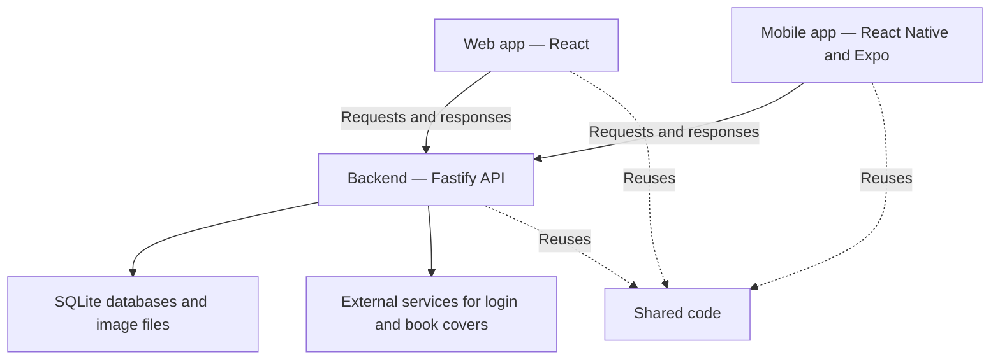

# Scripta architecture

A beginner's guide to how the project fits together.

Scripta is a personal e-book library app. Its web and native mobile apps connect to the same backend, which manages accounts, saves data, and handles sharing and voting. This guide explains each part, follows a library save through the system, and shows where to start when changing a feature.

## The big picture

Think of a library building: the apps are the front desk, the backend is the staff, and the databases are the filing cabinets. Shared code is the rulebook that helps the different parts behave consistently.



An **API** is how an app asks the server to do something. The server sends back a response, such as a saved library or an explanation of why a request failed. Both apps use the same backend, but have their own screens and navigation.

## What each folder does

| Folder | Purpose |
|---|---|
| [`frontend/`](../frontend/README.md) | The React website: pages, buttons, book cards, and mural editing. It can be installed as a PWA, a website with app-like installation and caching. |
| [`mobile/`](../mobile/README.md) | The native phone app, built with Expo and React Native. It has its own screens and uses the same backend. |
| [`backend/`](../backend/README.md) | The Fastify server: checks identity, processes requests, and stores data. |
| [`packages/shared/`](../packages/shared/src/index.ts) | Reusable data definitions and rules for books, merging, groups, murals, brackets, and tier lists. |
| [`exporter/`](../exporter/README.md) | A Python tool that reads a Kobo database and exports book information and highlights to `library.json`. |
| [`viewer/`](../viewer/README.md) | The older standalone HTML viewer. Opens library files without an account or backend. |

All these folders live in one repository. This arrangement is called a **monorepo**. The exporter and viewer can work independently of the accounts-based apps.

## Inside the backend

The backend is a **modular monolith**: one running server, divided into departments called modules. Each module owns a feature area. [`backend/src/app.ts`](../backend/src/app.ts) connects them when the server starts.

| Module | Responsibility |
|---|---|
| `auth` | Accounts, login, and sessions |
| `library` | Your saved library and its public share link |
| `gallery` | Uploaded images |
| `covers` | Finding and caching book covers |
| `socials` | Connecting social accounts |
| `arena` | Book tournaments and votes |
| `murals` | Freeform dashboards and sharing |
| `tierlists` | Book rankings and community voting |

Modules use each other through public entry points rather than importing internal files. For example, the library module uses the auth module's public login guard to check requests.

### Where the data lives

Each backend module has its own SQLite database file. SQLite stores structured data in a file on the server. Uploaded images and cached covers are stored separately as image files; database records track the relevant metadata.

**Your library is one JSON document per account**, containing books and associated library settings. JSON is a text format for structured data. Scripta does not use a central database table with one row per book. Murals, tournaments, and tier lists have their own storage.

### How a module separates its work

The term **hexagonal architecture** means that feature rules are separated from the database machinery. The important pieces are:

| File or folder | Job |
|---|---|
| `routes.ts` | Receives requests, validates inputs, and builds responses. |
| `service.ts` | Performs the feature's operation using the storage interface. |
| `domain/ports.ts` | Defines the storage operations the service needs. |
| `adapters/sqlite/` | Implements those operations using the actual database. |
| `plugin.ts` | Wires the routes, service, and storage together. |

```text
Request → Route → Service → Storage adapter → SQLite
```

The service depends on the interface in `domain/ports.ts`, rather than directly on SQLite code. This lets a service be tested with pretend storage. A different storage implementation can be connected without rewriting the feature rules.

## Following a library save

Here is what happens when you change your library in the web app. The native app talks to the same backend API through its own client code.

1. **You make a change.** The app prepares an updated library document.
2. **The app sends a request.** It sends the document to `PUT /library`. `PUT` is the HTTP method used here to save the replacement document; `/library` is the endpoint address.
3. **The backend checks the request.** It verifies your login and checks that the submitted data has the expected structure.
4. **The service saves the document.** The library service asks its storage adapter to write the data to SQLite.
5. **The app shows the saved result.** The server returns the saved document and its new version timestamp. The app uses that response to update what you see.

### What if two devices save at once

The save includes a version timestamp. If another device has already changed the library, the server rejects the outdated save with a `409` conflict response. The web save helper can fetch the latest document, apply the change again, and retry once. This helps prevent an old copy from overwriting newer changes.

To follow this in code, read:

- [`frontend/src/api/library.ts`](../frontend/src/api/library.ts) — sends the library request.
- [`frontend/src/lib/saveLibraryUpdate.ts`](../frontend/src/lib/saveLibraryUpdate.ts) — reapplies an update after a conflict.
- [`backend/src/modules/library/routes.ts`](../backend/src/modules/library/routes.ts) — checks the request and calls the service.
- [`backend/src/modules/library/service.ts`](../backend/src/modules/library/service.ts) — asks storage to save the document.
- [`sqliteLibraryRepository.ts`](../backend/src/modules/library/adapters/sqlite/sqliteLibraryRepository.ts) — performs the database write and checks the version.

## Where to look when changing a feature

| Change | Start here |
|---|---|
| Web screens and appearance | `frontend/src/pages` and `frontend/src/components` |
| Native screens and navigation | `mobile/src/app` and `mobile/src/features` |
| Rules shared between clients | `packages/shared/src` |
| Server behavior or saved data | `backend/src/modules/<feature>` |
| How server modules are connected | `backend/src/app.ts` |

Read the relevant folder README first, then trace one feature from its screen to its API call and backend module.

## Useful terms

| Term | Meaning |
|---|---|
| Client | The web or mobile app making a request. |
| Backend | The server answering the request. |
| Endpoint | An API address for an operation, such as `/library`. |
| Cache | A saved copy that avoids repeating a download or calculation. |
| Adapter | Code that connects a feature to a specific tool, such as SQLite. |
| Session | The login state that lets the server recognize your account. |

Architecture snapshot: 9 September 2026. Some older README sections describe earlier behavior; use the current implementation when they disagree.
